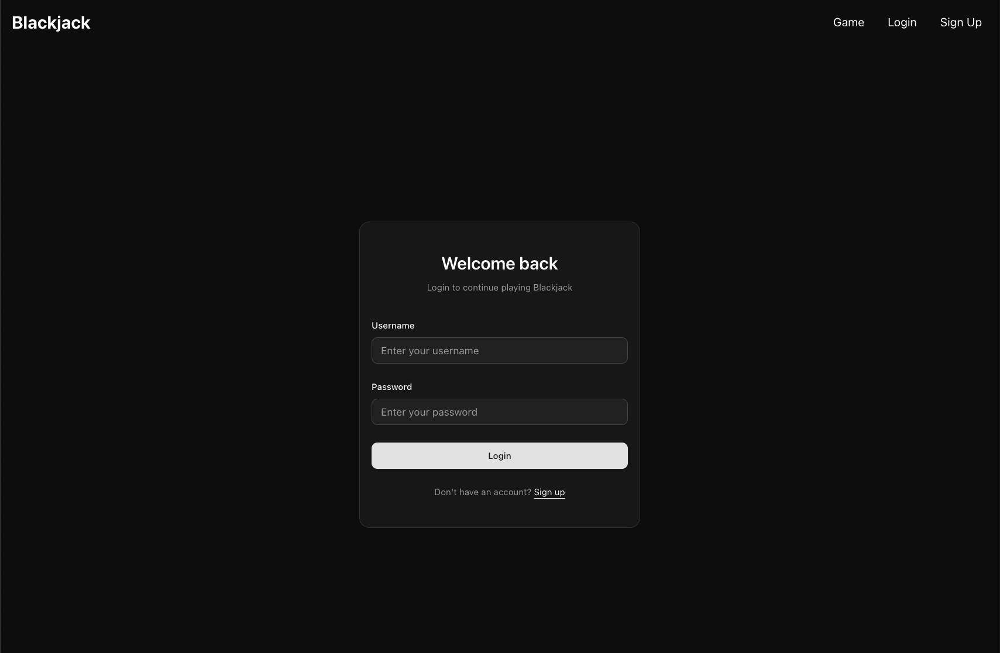

# Blackjack Game

A full-stack web application implementing the classic casino card game Blackjack, featuring user authentication, game history tracking, and AI-powered gameplay assistance.

🔗 **Live Demo:** [Your Vercel URL here]

---

## Features

### Core Gameplay
- Fully functional Blackjack game following standard casino rules
- Smooth card animations and intuitive UI
- Real-time game state management
- Hit and Stand actions with immediate feedback
- Automatic dealer play following casino rules (hit on 16, stand on 17)

### User Authentication
- Username and password authentication system
- JWT-based session management
- Secure password hashing
- 500 starting chips for new users
- Persistent login sessions

### Chip Management
- Real-time chip balance tracking
- Bet placement system with validation
- Automatic chip updates after each hand
- Refresh-safe implementation (chips deducted immediately, games saved as provisional losses)

### Game History
- Comprehensive statistics dashboard
- Win/loss/push tracking
- Net profit calculations
- Detailed game log with timestamps
- Paginated history view
- Responsive table/card layout for all devices

### AI Assistant
- Gemini API integration for gameplay suggestions
- Strategic advice based on current hand
- Visual highlighting of recommended actions
- Real-time decision support

### Responsive Design
- Mobile-first approach
- Adaptive layouts for all screen sizes
- Touch-friendly controls
- Optimized for phones, tablets, and desktops

---

## Tech Stack

**Frontend:**
- Next.js
- React
- TypeScript
- Tailwind CSS
- shadcn/ui components

**Backend:**
- Next.js API Routes
- MongoDB (database)
- JWT authentication
- Gemini API (AI assistant)

**Deployment:**
- Vercel

---

## Asumptions & Simplifications
- Infinite deck: Cards are drawn with constant probability (no deck tracking or shuffling)
- Limited actions: Only Hit and Stand are available (no Split, Double Down, or Insurance)
- Client-side gameplay: Game logic runs on the client; only chips and history sync with server
- Refresh handling: If a player refreshes during an active game, the bet is not loss since games are only saved when completed
- Dealer visibility: Dealer shows only one card initially (standard casino rules)